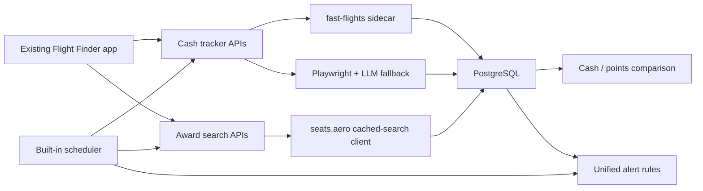

# Flight Finder award workspace brief

Status: 2026-07-25
Application: `C:\Users\dougl\projects\base-flight-finder`
Live route: `http://localhost:3003/awards`

## What was built

The existing Flight Finder Next.js application now handles cash fares and award-seat monitoring in one local interface.

The original cash tracker remains the application foundation. It saves route/date searches, collects fare observations through the local fast-flights sidecar, falls back to the inherited Playwright/LLM path, plots price history, and evaluates price alerts.

The new Awards route saves an origin, destination, inclusive date window, cabin, and optional loyalty programs. It stores award observations from the gated seats.aero client, compares them with the lowest overlapping stored cash fare, calculates cents per point, and creates seat-availability alert rules.

## The two comparison modes

### Simple

Simple mode answers the immediate decision:

- best observed mileage cost and taxes;
- available seats, program, cabin, and travel date;
- observation freshness;
- best overlapping stored cash fare;
- value after taxes in cents per point;
- airline-confirmation warning before points are transferred.

### Analyst

Analyst mode exposes the observation ledger:

- date;
- program;
- cabin;
- seats;
- miles;
- taxes;
- stored cash fare;
- cents per point;
- observed time.

The selected mode persists for the browser session. On small screens, table rows reflow into labeled records.

## Current Norfolk-to-Berkeley search

A local award search is saved for:

- origin: ORF;
- destination: OAK, the airport selected for the Berkeley-area request;
- travel window: August 14–17, 2026;
- cabin: economy;
- programs: unrestricted.

The route currently has no award observations because the seats.aero provider credential is absent. Refreshing the search preserves the route and gives the accurate server-configuration recovery path.

The existing cash side already has ORF → OAK observations. The award detail API selects the lowest available cash observation whose tracked route and date window overlap the award search.

## How data moves

The scheduler runs due cash searches, due award searches, and rule evaluation on the same three-hour base interval with jitter. Award API calls are guarded by an in-memory daily counter capped at 1,000. Rules suppress repeat notifications for an unchanged condition during the 24-hour deduplication window.

## Research and code used

### Used directly

- `affromero/flight-finder` supplied the MIT-licensed application foundation: Next.js interface, Prisma/PostgreSQL persistence, cash tracker, charts, scheduler, notification channels, REST conventions, and CLI.
- `AWeirdDev/fast-flights` supplied the keyless Google Flights protocol client. A local FastAPI sidecar normalizes its output for Flight Finder.
- seats.aero’s official API documentation guided the cached-search client, attribution, freshness treatment, and 1,000-call guard.
- Google Flights help informed the distinction between a quick best option and a denser comparison view.
- point.me help informed cash-versus-points presentation and the cents-per-point calculation.
- `research/flight-finder-integration-plan.md` supplied the phased cash, fast-flights, award, alerting, and verification requirements.

### Used as conceptual reference

- `punitarani/flights-tracker` demonstrated the award-plus-alert pattern. Its repository had no reusable license, so no code was copied.

### Deliberately unused

- seats.aero website automation and its MCP surface remain outside this application integration.
- SerpApi price insights and mistake-fare detection would add a paid dependency and remain separate work.
- Duffel booking and points transfer execution remain outside the tracker.
- Docker was skipped for this machine; PostgreSQL, the Python sidecar, and the web app run natively.
- Redis was skipped because Flight Finder degrades safely when `REDIS_URL` is absent.

## What the app can do now

- Track cash fares and retain price history.
- Use fast-flights as the primary structured cash source.
- Fall back to the inherited browser/LLM extractor when the sidecar cannot return fares.
- Save award-search definitions before the provider is connected.
- Store award snapshots with program, cabin, seats, mileage, taxes, travel date, and last-seen time.
- Show Simple and Analyst comparison modes.
- Match an award search to an overlapping stored cash observation.
- Calculate `(cash fare - award taxes) / miles × 100`.
- Omit cents per point when cash, taxes, or mileage inputs are unavailable.
- Create cash-price and award-seat alert rules.
- Evaluate cash searches, award searches, and rules in the scheduler.
- Deduplicate unchanged alerts for 24 hours.
- Preserve stored observations when an award refresh cannot run.

## Current limits and open items

| Item | Current state |
|---|---|
| Live seats.aero results | Requires a paid Pro API key. The live endpoint and response-field mapping still need one real cached-search verification. |
| Real award notification | Requires live award availability plus a configured notification destination. |
| Notification delivery | Email, ntfy, Telegram, or webhook must be configured before alerts can reach Douglas. |
| Scheduler elapsed-time proof | The loop starts correctly; one naturally elapsed three-hour run still needs observation. |
| Saved award-search management | Create and select are implemented. Rename, pause, and delete controls remain future lifecycle work. |
| Program discovery | Programs are entered as optional comma-separated names until the live provider catalog is verified. |
| Booking | The app monitors and advises; it does not book, transfer points, or guarantee cached availability. |

## Verification evidence

- Web lint passed.
- Web and CLI TypeScript checks passed.
- Web tests: 1,376 passed, 2 skipped across 106 passing files and one skipped file.
- CLI tests: 43 passed across six files.
- Total passing tests: 1,419.
- Next production build completed and includes `/awards` plus all award APIs.
- CLI bundle completed; its final run required filesystem access outside the restricted sandbox.
- Production health returns `ok` on port 3003.
- The production award collection contains the saved ORF → OAK search.
- Desktop and 390px browser interaction checks passed with no horizontal overflow.
- Simple/Analyst selection, attribution, empty state, provider-paused recovery, and the home-page Awards link were verified live.
